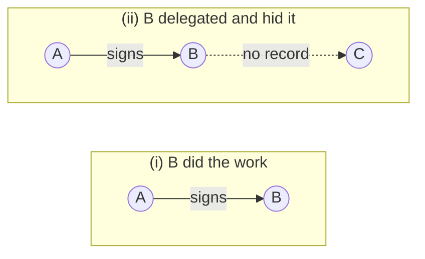
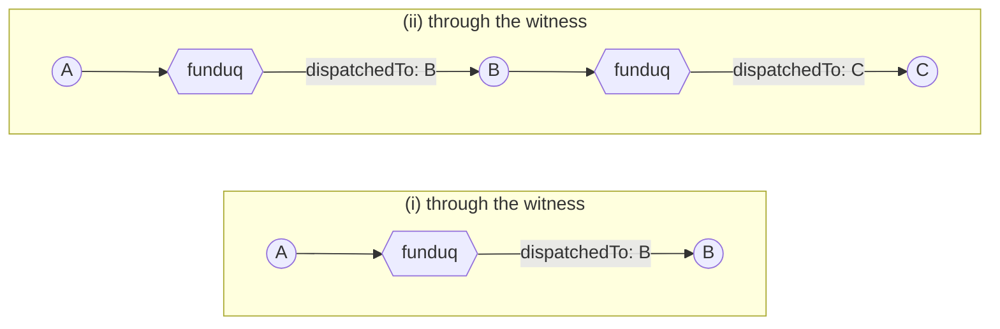
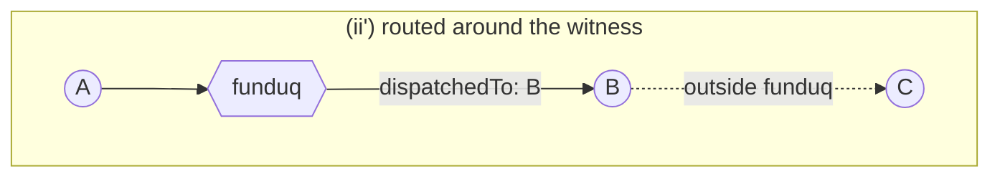

# Responsibility chains

Part of [funduq's mechanisms](../mechanisms.md).

**Status: implemented, except vouchers.** This header used to read
"design, not implementation" long after the code had caught up — the same
mistake as the extensions table, and recorded once already: believing a page
that lags the code rather than the code. What is enforced today lives in
`doors.py` (birth binding, membership, the authority set for resolutions and
cancels, the presenter check), `identity.py` (the signed-act verifiers),
`repo.py` (the head and chain a run is opened under, and who answered) and
`funduq_contract.chain`; the tests are `test_responsibility_chains.py`,
`test_delegation_chain.py`, `test_run_keeps_its_chain.py`,
`test_pause_resume.py` and `test_the_record_names_who_answered.py`. The one
genuinely unbuilt part is the **voucher** — see "The chain is only keys". The
earlier full record is
[`design/responsibility-chains.md`](https://github.com/hukaichun/funduq/blob/d78d0638c0ec2126167240c62471651b5468d35b/design/responsibility-chains.md),
pinned to history; this page supersedes it where they differ.

## The problem

A user talks to a main agent; the main agent delegates to a sub-agent;
the sub-agent pauses for a human answer (`input-required`). Who may
answer, what proves they were entitled to, and what records that it was
them? The spec of neither protocol says; funduq has to.

**What "responsibility" means here, and what it does not.** A chain records
*who was drawn in*, never *who is to blame*. The second is a judgement — it
moves with a jurisdiction, a contract, and someone entitled to make it. The
first is a fact: one party handed work out, another took it. That is why a
chain crosses an organizational boundary where a permission cannot. Both
sides can read "these hands touched this" without first agreeing on any
vocabulary, and nobody has to be entitled to anything to read it. Rule zero
in other words: funduq records, and does not adjudicate.

## The frame: two entrances, one of them gated

Every seam has exactly two entrances — an **utterance**, or a deferred
call's **result** (see
[the design record](../design-records.md#every-seam-has-exactly-two-entrances-an-utterance-or-a-result)).
Responsibility chains gate the **result lane**: who may supply the
answer a paused ask is waiting for. Speaking is not gated among a
conversation's members — a member interjects or takes the next turn
without asking anyone's permission. What a chain adds on the utterance
side is only *membership itself*: on a bound thread (below), a
non-member cannot speak at all.

## A user is a position, not a type

funduq has one identity primitive — an Ed25519 keypair — and it already
plays two roles (agent provider, LLM provider). A "user" is the same
primitive in a third position: **the head of a responsibility segment**.
There is no user database, no account, no registration: a key exists by
being seen, and funduq recognizing a returning key never by itself
discloses anything to anyone.

The position is symmetric. When a main agent delegates over A2A and
signs the first hop of a *new* chain with its own key, it stands at the
head of the sub-segment exactly as a human stands at the head of theirs:
same signature, same answering rights over the segment's asks, same
view over the segment's threads. Humans usually sit at the root; that is
a social fact, not a mechanical one — the machinery never needs to know
whether a head is a person.

**Custody is deployment, not ontology.** Where the head's key lives is
the serving layer's business, and three models coexist:

- **self-held** — a file next to a CLI; works today;
- **passkey** — WebAuthn as the custodian; the platform authenticator
  signs once per session (its own envelope, verified at the bridge);
- **enterprise-custodied** — the gateway holds a per-user key behind
  SSO and signs after the IdP says yes.

All three converge through one bridge: the **session delegation
certificate**. The durable key `D` signs, once, a statement naming an
ephemeral in-page key `SK` and an expiry ("SK acts for me until T").
Thereafter SK signs everything — chain hops, resolutions — with the
certificate attached, and verification resolves SK's signatures to D's
authority. Rights attach to D and survive the session; SK is a glove.
This certificate is a new signed-payload family (chain extension alone
cannot express it: extending a chain is *provenance*, and anyone may do
it — delegating authority to a named key requires the durable key to
say so explicitly).

## The chain is only keys

A hop carries `{actorPublicKey, prevHash}` and a signature — **no
`subject`, and no time** (`iat`/`exp` are gone: freshness is the
authenticating seat's job, not the hop's, so a hop never expires). The
shipped format's `subject` field was a self-claim:
the signer asserting whom the key represents, which funduq could record
but never verify — an assertion wearing the record's clothes. It is
removed from the design.

What replaces it splits into the two layers that were always distinct:

- **Authorization** is the chain itself: pure keys. Everything a chain
  is consulted for — answering rights, thread membership, segment
  visibility — reads keys and nothing else.
- **Disclosure** is a separate, opt-in credential: a **voucher**, signed
  by the party who actually knows ("key SK↔ employee_x, per this IdP" —
  signed by the gateway). Presented when the head *wants* to be known;
  absent otherwise. Pseudonymity is the default by construction, and
  "authorization is not disclosure" stops being a policy statement and
  becomes the file format.

The honest cost: until vouchers exist, every surface that shows a
caller shows a key fingerprint. An enterprise deployment will want
vouchers early; they are on the implementation list, not optional.

**And funduq stops summarizing.** `forwardedProps.caller` — the
verification digest funduq used to prepare for the agent (subject,
resolved actors, chain) — goes with `subject`. Its only real payload
was the raw chain, which is the *caller's* utterance, not funduq's: it
now rides to the agent verbatim, on the same two-slot pattern as any
caller-declared data (AG-UI callers write their own `forwardedProps`;
A2A callers use message metadata and funduq copies it over unchanged).
The agent verifies for itself — it never should have trusted a relay's
digest, and the digest's own docstring said so. funduq's inbound
verification serves funduq alone: refuse a chain that does not verify,
and copy the head key onto what needs it. With no digest there is also
no digest to forge, so the `verifiedActorChain` reserved-key defense
retires with it. What funduq does about caller identity is four verbs —
verify, copy the head, relay, refuse — and there is no fifth.

## Break and extend are behaviors, not metadata

An earlier shape of this design declared `break`/`extend` per delegation
edge. The declaration turned out to be redundant — **the chain's growth
is the declaration**:

- **extend** = the delegating party signs the incoming chain onward
  (`extend_chain`). The escalation path stays connected: the segment
  head's answering rights and visibility reach into the sub-thread.
- **break** = it does not. No flag, no field: silence severs. The
  delegator may start a fresh chain headed by itself (becoming the
  sub-segment's head), or delegate bare. The default is break because
  extension requires a positive act of signing.

Breaking also protects *downward*: carrying the user's chain through a
break edge would advertise whose work this ultimately is to
subcontractors the user never chose. Opacity cuts both ways — the
upstream cannot see the subtree, and the subtree cannot see upstream's
head.

Segment boundaries are therefore **derived, never registered**: a
sub-thread carrying the same head is the same segment; a new head or no
chain ends it.

This buys the property at a cost that has to be said in the same breath:
**declining to extend and erasing a hop are the same shape.** Both leave the
chain shorter and both verify. What narrows it is funduq's own **dispatch
hop** — a hop funduq signs naming where it sent the work, `dispatchedTo:
{providerKey, name}` — because an agent is addressed as (provider key, name)
and that provider key is what signs the next hop when the provider extends
honestly. A hop and its successor then check each other, and a hidden branch
cannot satisfy both. See [Actor chain](actor-chain.md), which carries the
probe, and "Why a witness" below for why no protocol between only two
parties can do this.

## Lineage and responsibility are different layers

`referenceTaskIds` and `taskId` build **lineage** — funduq's own
structural record of which thread spawned which and which utterance
continues what. Lineage is always recorded, chain or no chain; a break
edge does not thin funduq's books. The chain decides **who may see and
act across** that structure. Passing a reference id down a break edge is
the delegator's own act of disclosure — it hands the sub-party an
upstream id it legitimately holds; not passing it means that edge never
appears in anyone's view of the tree.

## What binds, what locks, what stays open

**A thread binds at birth, immutably.** If its first run carries a
chain, the thread records {segment head `H`, serving provider `P`}.
Later runs cannot add or change the binding — an anonymously-opened
thread is never retroactively locked against its own opener.

- **Writing is membership.** On a bound thread only `H` and `P` may
  utter — members interject freely, non-members cannot speak. On an
  unbound thread, today's behavior stands unchanged.
- **Answering is authority.** A paused ask records, at pause time, its
  authority set from its run's chain: {segment head, the provider's own
  key}. A resolution is signed over
  `funduq-resolve:{run_id}:{timestamp}` — a singular act, so the
  timestamp family, checked against the 60s window; the status-guarded
  reopen consumes the signature with the win. Who resolved, under whose
  authority, is recorded.
- **Stopping is the same authority.** Asking a provider to stop one of a
  bound thread's runs takes a signature from that same set, over
  `funduq-cancel:{run_id}:{timestamp}` — its own tag, so a resolution
  can never be spent as a cancel. It is the same question asked twice:
  who does this run's segment answer to? Left outside at first, which
  meant a complete stranger holding the run id could stop your run — and
  a run id is an identifier, never a credential.
- **Reading a known id stays open at the core.** Locking reads at the
  door would gate confidentiality funduq cannot actually deliver (the
  database is readable by its operator; real secrecy is encryption,
  which this is not) while breaking every unauthenticated read a
  standard client makes. Confidentiality is the host's layer: a gateway
  that authenticates sessions gates reads as deployment policy. The
  core's split is: **it enforces integrity (writes, resolutions) with
  signatures; it leaves confidentiality (reads) to the deployment.**
- **Discovery respects segments.** Tree and listing queries stop at
  segment boundaries: a broken-off subtree does not appear in an
  upstream head's view. Invisibility is honest about what it is — not
  being enumerated — never a pretense of secrecy for a party who
  already holds the id.

## Why a witness

A chain is signed by its own parties, hash-linked, and verifies offline.
**It does not need funduq to hold it.** So the reason a broker exists at all
cannot be "someone has to keep the record" — it has to be a property that
two parties cannot reach between themselves.

**The property.** Given A delegating to B, an outside reader must be able to
tell apart:

- **(i)** B did not delegate onward, and did the work itself;
- **(ii)** B delegated to C and left no record of it.

Responsibility lands in different places. Under (i) B heads that segment and
there is no subtree. Under (ii) C was drawn in and nobody can see it.

**Two parties cannot.** Every piece of evidence about B→C is produced and
held by B and C. B will not offer it, and C has no relationship to A — it
does not know A exists and has no reason to speak to it. So under everything
A can obtain, (i) and (ii) are the same shape. Cryptography does not help
here: the problem is not that a signature might be forged, it is that **a
signature never produced leaves no gap**.

Both leave the same chain: `[A, B]`.

**What separates them** is a party that *both edges pass through*, signing
where the work went. Under (i) it signs one dispatch; under (ii) it signs
two, and the second names C.

**It has to see; it does not have to judge.** This is what fixes which kind
of third party funduq is. The fair-exchange literature proves strong fair
exchange is impossible without a trusted third party — and *there* the third
party is a judge: those protocols carry abort and recovery sub-protocols and
a dispute-resolution policy saying how a judge settles (Pagnia & Gärtner,
TUD-BS-1999-02, 1999). The property above is strictly weaker. It is
**distinguishability**, not fairness, and distinguishing (i) from (ii) needs
only a party that sees both edges — nobody has to be entitled to rule on
anything. funduq is a **witness, not an arbiter**, and asking for less is
exactly why it is deployable between parties who do not agree on much.

**Necessary, not sufficient, and the scope is on the label.** This covers
delegation that *passes through* the witness. If B hands the work to C
entirely outside funduq, distinguishability is not weakened — it is gone.

Which is the same chain as (i) again. The probe for this is still red, and
[Actor chain](actor-chain.md) carries it. funduq does not claim to have
closed (ii); it claims to have narrowed it from **invisible** to **invisible
only outside what the witness sees**.

## The complete invention list

Three signed-payload families and three enforcement points; nothing else.

1. **Hop** — `{actorPublicKey, prevHash}`, signed, and nothing else.
   Exists. The chain's growth is the responsibility declaration. (This
   entry read `{actorPublicKey, prevHash, iat, exp}` while the section
   above it said a hop carries no time; the section was right.)
2. **Session delegation certificate** — durable key names an ephemeral
   key with an expiry. New. Custody's bridge.
3. **Voucher** — a knowing party binds a key to a name. New, opt-in.
   Disclosure's channel.

Enforcement: copy the segment head onto asks and threads at their
birth; check a resolution and a stop request against the set that copy
recorded; filter discovery by segment. No funduq-authored summary exists
anywhere in the design: the chain reaches the agent as the caller's own
words, and everything else — who is a user, where break points are, who
may answer — is derived from where signatures actually reached.

## Deliberately out of scope here

Funding (which KYOK offering pays for a subtree) is a separate topic
with its own discussion; nothing on this page decides it. Cancel is
outside the entrance taxonomy entirely — a control request about a run,
not an input, and no precedent for gating one.

## Design records

- [Every seam has exactly two entrances](../design-records.md#every-seam-has-exactly-two-entrances-an-utterance-or-a-result)
- [Rule zero: identifiers are never credentials](../design-records.md#rule-zero-identifiers-are-never-credentials)
- [Anonymity means the key is unlinked, not that there is no key](../design-records.md#anonymity-means-the-key-is-unlinked-not-that-there-is-no-key)
- [One question per delegation edge decides the whole tree](../design-records.md#one-question-per-delegation-edge-decides-the-whole-tree)
- [Authorization is not disclosure](../design-records.md#authorization-is-not-disclosure)
